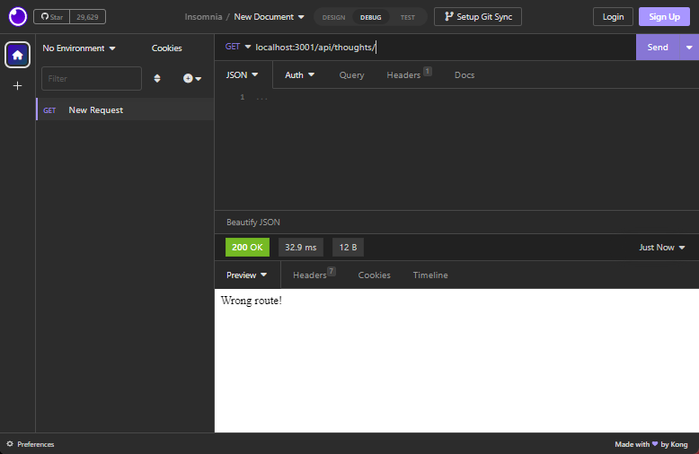

# NoSQL Challenge: Social Network API

This app is a work-in-progress. Sadly, time constraints prevented this exercise from being completed.

## Video Walkthrough

[Walkthrough demonstration](https://watch.screencastify.com/v/vxA7EIxx5FzoVoyppGiD)

## Screenshot

The 404 message works exactly as intended.

(So far, that's as close as the app is to functionality)

## Accreditation

This code here is modeled heavily after a in-class project in the curriculum content. It's essentially copied whole cloth. The source of the model is: (/18-NoSQL/01-Activities/28-Stu_Mini-Project/Main)

I myself have made no meaningfulcontributions to any part of the code. The only things I did were make a walkthrough ("walkthrough") video, take a screencap, and make this readme.
